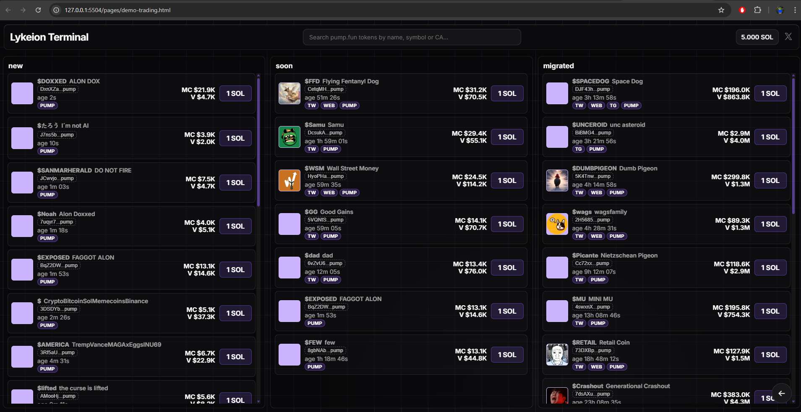
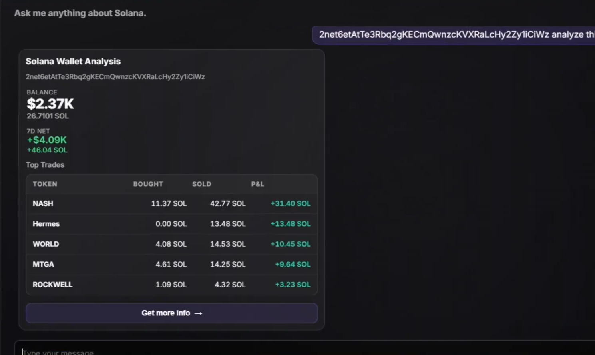

# Lykeion

Learn to trade Solana memecoins — lessons, practice tools, and an AI trading assistant in one place.

Live: [lykeion.app](https://lykeion.app)

---

## What's inside

- **Course** — structured lessons on Solana trading, memecoin mechanics, and trading bots.
- **Demo Terminal** — a practice trading terminal with a live pump.fun feed (new / soon / migrated columns), virtual SOL balance, and a real GeckoTerminal chart per token.
- **Lykeion AI** — a Solana-focused chat assistant. Ask for token info, price snapshots, hot tokens, launchpad volume, or a full wallet analysis.
- **Wallet Analysis** — deep on-chain breakdown of any Solana wallet, powered by the [Helius](https://www.helius.dev/) Enhanced Transactions API.

---

### Demo Trading Terminal


### Wallet Analysis (Lykeion AI)


---

## Wallet Analysis features

Paste any Solana address into the AI and get:

- **Balance + 7D Net PnL** (SOL and USD)
- **Top trades** — bought, sold, realized + unrealized PnL per token

Tap **Get more info** to unlock:

- **Trade frequency** — per-hour and per-day-of-week charts; auto-classifies the wallet as bot / scheduled farm / late-night degen / active trader
- **Average hold time** — matches buy→sell pairs per mint; shows fastest flip and longest hold
- **Possible side wallets** — detects linked wallets via outbound SOL transfers and shared token entries

All three are computed from Helius Enhanced Transactions (`events.swap`, `tokenTransfers`, `nativeTransfers`).

---

## Tech

- Vanilla HTML / CSS / JS (no framework)
- Express static server ([server.js](server.js))
- Firebase Auth + Firestore (chat history)
- OpenAI `gpt-4o-mini` (assistant replies)
- Helius RPC + Enhanced Transactions (wallet analysis, token metadata)
- DexScreener (prices + token names)
- GeckoTerminal embed (charts)
- Vercel deployment

---

## Running locally

```bash
npm install
cp .env.example .env   # fill in keys
node server.js
```

Open `http://localhost:3000`.

### Required env vars

```
OPENAI_API_KEY=sk-...
HELIUS_API_KEY=...
SOLANA_TRACKER_API_KEY=...   # optional, for a few widgets

FIREBASE_API_KEY=...
FIREBASE_AUTH_DOMAIN=...
FIREBASE_PROJECT_ID=...
FIREBASE_STORAGE_BUCKET=...
FIREBASE_MESSAGING_SENDER_ID=...
FIREBASE_APP_ID=...
```

Secrets are exposed to the client through `/api/lykeion-secrets` and `/api/firebase-config` — only the non-sensitive keys are forwarded.
